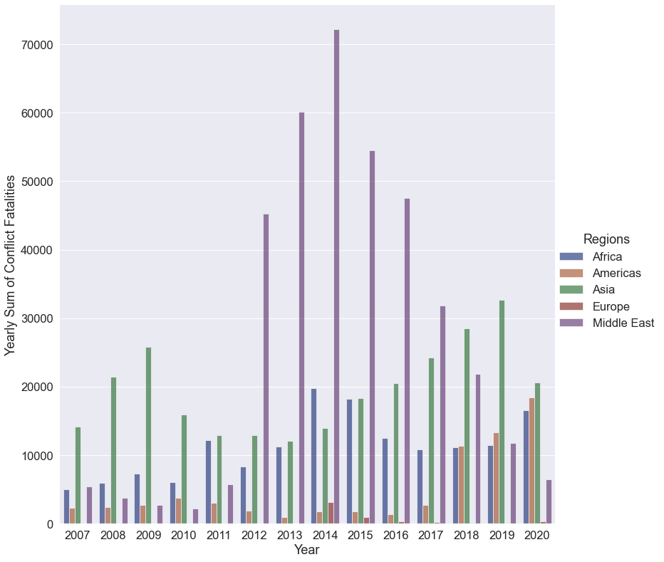
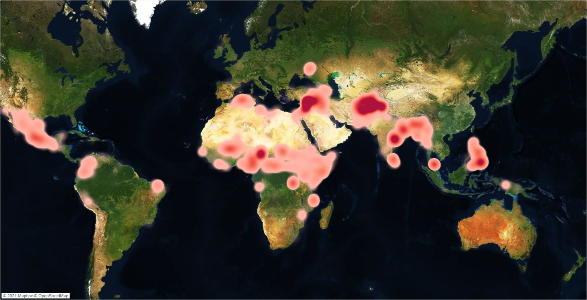

# Regional-Conflict-Modelling
As the global community slowly emerges into a post-covid world, regional conflicts and incidents of organised violence continue to devastate societies across regions at scale.

The aim of this project was to use state of the art machine learning models to predict whether an act of organised violence, belonging to an identifiable conflict and producing at least one fatality, could be successfully predicted to belong to a defined severity class.

This project was conceived with International Aid Organisations, Human Rights Groups and Humanitarian agencies in mind.

## Notebook Contents

| Notebook Name                     | Contents                                                      |
|-----------------------------------|---------------------------------------------------------------|
| Introduction_Cleaning_part1.ipynb | Project Introduction & Cleaning Notebook                      |
| EDA_part2.ipynb                   | Exploratory Data Analysis Notebook                            |
| Vaex_modelling_part3.ipynb        | Vaex Models                                                   |
| Subsample_modelling_part4.ipynb   | All Other Models                                              |
| Expanded_corr.ipynb               | Correlation table expanded with encoded categorical variables |

## Goal of the Project
The goal of this project is to create a classification model which can use country level data, such as economic, demographic and business environment indicators, to outperform the baseline accuracy when classifying an act of violence into one of four severity levels. These severity levels are defined as:

- Low Fatality Incident
  - An organised incident of violence with 2 fatalities of fewer.

- Moderate Fatality Incident
  - An organised incident of violence with over 2, but less than 10 (inclusive), fatalities.

- High Fatality Incident
  - An organised incident of violence with over 10, but less than 100 (inclusive), fatalities.

- Very High Fatality Incident
  - An organised incident of violence with over 100 fatalities.

## Data Source & Overview
The Uppsala Conflict Data Program (UCDP) is one of the leading global providers of conflict level data, with experience in collecting and analysing data on armed conflicts going back 40 years. The particular dataset used for this project was the “UCDP Georeferenced Event Dataset (GED) Global version 21.1”, which is one of the most disaggregated data sets maintained by the UCDP.

Version 21.1 contains just over 261,800 observations, each being an incident of organised violence recorded between the years of 1989 and 2020. Features included in the dataset, per conflict, include fatality estimates, incident location, media reporting source, the parties involved, and many more.

## Cleaning & Processing
As the core dataset used in this project is very well maintained, the data cleaning requirements were minimal and processing revolved more around:

- Identifying variables relevant to modelling, and which to drop.
- Interpreting continuous and categorical features.
- Creating more model-friendly feature names.
- Exploring opportunities for new feature creation.
- Looking for erroneous or missing data. 
- Creating the target variable.

## Feature Engineering
Feature engineering focused on aggregating country level data for the countries included in the data set (119 countries, each with data for the years 1989 - 2020). The final features engineered into the core data set included:

- Country. 
- Year.
- Capital Investment as a Percent of GDP.
- Economic Growth: the Rate of Change of Real GDP.
- Savings as a Percent of GDP.
- Inflation: Percent Change in the Consumer Price Index.
- Percent of World Tourist Arrivals.
- Death Rate per 1000 People Human Flight.
- Brain Drain Index Government Debt as a Percent of GDP.
- Innovations Index.
- External Debt as a Percent of Gross National Income.
- Labor Freedom Index.
- Remittances as a Percent of GDP.
- Population Growth Percentage.
- Banking System Z-Scores.
- Oil Reserves (in Billions of Barrels).
- Percent of World Oil Reserves.
- Daily Oil Production (in Thousands of Barrels).
- Trade Balance as Percent of GDP.

During this process, due to the lack of availability of feature data in the years leading up to 2007, the decision was taken to reduce the scope of the core dataset to only model using incidents occurring after 2007. This allowed more of the external feature data to be used, of which the features most positively and negatively correlated to the project target (number of fatalities), were selected to be used for modelling.

## Exploratory Data Analysis
The EDA process highlighted trends across regions and countries in:

- Number of Conflicts.
- Number of Fatalities.
- Number of Fatalities per conflict.
- Number of Fatalities per Groups Involved in Conflicts.

**Table 1: Sum of Fatalities per Year**

**Table 2: Tableau Heatmap of Incident Fatalities**

## Modelling
Two approaches are taken to modelling, the first being to use all observations available by running models using Vaex (a library purpose built to “visualize and explore big tabular datasets”), the second being a more traditional approach of subsampling the data to allow for processing on local machines.

All data fed to models have classes treated with SMOTE to ensure an even balance (apart from Vaex Model 1, which is run on imbalanced data for comparison). Data is standardised using a StandardScaler and categorical data is processed with either a LabelEncoder or Frequency Encoder. Lastly the data is divided into train and test splits.

**Results**

| Model                                     | Class Balance | Data Volume (Obs)            | Baseline Accuracy | Model Accuracy |
|-------------------------------------------|---------------|------------------------------|-------------------|----------------|
| Vaex Model 1: XGBoost                     | Imbalanced    | Train: 134,683, Test: 33,670 | 56.8%             | 64.9%          |
| Vaex Model 2: XGBoost + SMOTE             | Balanced      | Train: 267,988, Test: 50,505 | 25%               | 62.3%          |
| Subsample Model 1: Logistic Regression    | Balanced      | Train: 50,000, Test: 20,000  | 25%               | 58.6%          |
| Subsample Model 2: Multi Layer Perceptron | Balanced      | Train: 50,000, Test: 20,000  | 25%               | 60.5%          |
| Subsample Model 3: Decision Tree          | Balanced      | Train: 50,000, Test: 20,000  | 25%               | 60.4%          |
| Subsample Model 4: Bagging                | Balanced      | Train: 50,000, Test: 20,000  | 25%               | 58.6%          |

## Limitations
**Lacking Full Breadth of Regional Data**

While the core data set being used in this project is very comprehensive, there are gaps in conflict data. Most notably there is no data from the United States, nor is there any data on incidents in Russia.

**Media Bias**

Conflict details are sourced from various different media sources, each of which will have differing levels of: process standards, political leanings, data quality assessments and oversight. This means that to a certain extent there will always be a bias inherent in the data.

**Imputations**

To allow the project to proceed, missing data was handled by imputing values where necessary. Although every effort was made to reduce the amount of imputation, the fact it was included does skew the data.

## Key Learnings
Aside from gaining hands-on experience with a number of new libraries, as well as the XGBoost model, there were two key learnings for me with this project:

**Data Science Workflow**

It became very apparent to me with this project that the regular workflow for a data science project is a very iterative thing. It is much less linear than I had first expected and experienced in smaller projects I had worked on previously. It was not a case of progressing from the EDA straight into modelling, for example, but rather a case of learning new things during the EDA which meant making tweaks to the work carried out during cleaning, prior to finally proceeding with modelling.

**Don’t Underestimate Feature Engineering**

Finding and joining appropriate data from various disparate sources was a much more time consuming process than I had first expected. The cleaning and reshaping required to mould external data into a state where it could be joined was no small task and my experience during this project has highlighted to me a need to become more familiar with the Pandas reshaping functionality.

## Challenges

One of the challenges with this project, which required me to give full consideration, was the sensitive nature of the project topic and how that sensitivity would require me to be very aware of how I communicate and present my work. As the project dealt with very emotionally charged topics around war, loss of life and political violence, it was paramount that I remain as respectful and considerate as possible when carrying out my research and analysis. This respectful consideration and attempt to carry out work in the most unbiased manner possible guided everything from variable naming to imagery used in my final presentation.

## Future Work
There are a number of next steps I would like to take in order to further this work and build on the above models. They are as follows, with the first step being the most important:

**Analyse the Precision, Recall & F1 Scores of Models**

While the classification reports and confusion matrices are included in the project notebooks, I would like to analyse and rank the models by say F1 score, as accuracy score is not always the most important when it comes to classification models.

**Dig Deeper Into Coefficients**

I am very interested in seeing exactly which variables were most important in moving the needle with regards to giving an incident a severity ranking.

**Tensorflow Model**

Lastly I would like to develop a more fully fleshed out neural network model, using Tensorflow, to predict incident severity.

